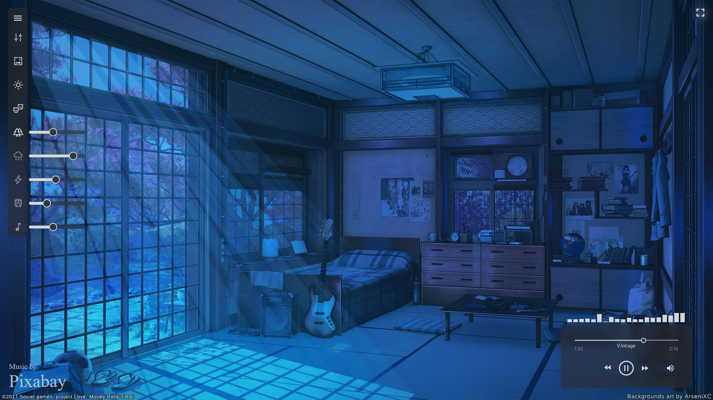

<!-- PROJECT LOGO -->
 

  

  <h3 align="center">Lofi Loft</h3>

  

    Lofi Streaming with Ambience
     
    <a href="https://lofi-loft.web.app/">
    lofi-loft.web.app
    </a>
     
  

[![TS][TS]][TS-url]
[![React][React]][React-url]

<!-- ABOUT THE PROJECT -->

## About The Project

Stream _lofi music_ and add _ambience_ like rain, thunder, traffic, and more.

 

  
  

   

(<a href="#readme-top">back to top</a>)

<!-- CONTACT -->

## Contact

Distributed under the MIT License. See `LICENSE.txt` for more information.

Walid Harkous- [@github](https://github.com/SimpleLogix) - harkouswalid@gmail.com

Project Link: [Lofi Loft](https://github.com/SimpleLogix/Lofi-loft)

(<a href="#readme-top">back to top</a>)

<!-- MARKDOWN LINKS & IMAGES -->
<!-- https://www.markdownguide.org/basic-syntax/#reference-style-links -->

[React]: https://img.shields.io/badge/React-20232A?style=for-the-badge&logo=react&logoColor=61DAFB
[React-url]: https://react.dev/
[TS]: https://img.shields.io/badge/TypeScript-007ACC?style=for-the-badge&logo=typescript&logoColor=white
[TS-url]: https://www.typescriptlang.org/
